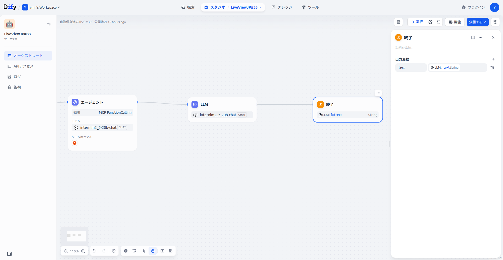
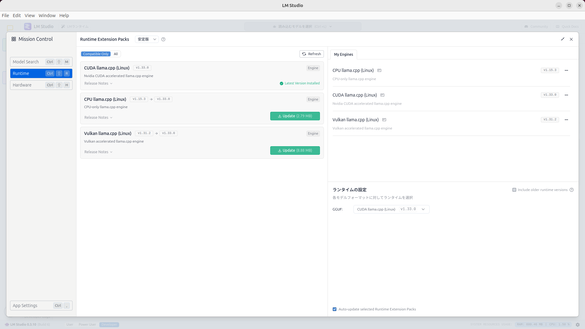

## ElixirでローカルLLM＋Difyを動かし、MCPが混ざると …
---
### 実際に動かしてみる😺

<video src="LLM_run.mp4" controls width="950" ></video>

---
 ## LiveView
 - 人間とのインターフェース
     
---
 ## Dify
  - LiveViewとのインターフェース
  - 開始はLiveViewから文章を受け取ります
  
---
 ## Dify
  - MCPサーバーとのインターフェース
  - クライアントとしてMCP FunctionCallingを使う
  
---
 ## Dify
  - LLMその２　
  
---
 ## Dify
  - LM-Studioとインターフェース
  - モデルプロバーダー OpenAI-API-compatible
  
---
 ## Dify
  - 終了はLiveViewから文章を渡します
  
---
## MCPサーバー
 - MCPサーバー（server-filesystem）
   - MCPクライアントの指示の元ファイル操作をする
 - MCPサーバーのプロキシ(supergateway)
   - SDTIO(MCPサーバ) <=>　Dify(SSE)に変換
###  server-filesystemをsupergateway経由で起動
 ```
 $ npx -y supergateway --stdio "npx -y @modelcontextprotocol/server-filesystem ~/local/mcp/tmp"
 ```
---
### MCPサーバーの検証
```
npx @modelcontextprotocol/inspector
```
 

---
 # LM-Studio
   - LLM（Large Language Models）を動かす本体
   - モデル internlm2_5-20b-chat
    
---
 # LM-Studio
   - ランタイム CUDA llama.cpp (Linux)
     - Vulkan llama.cpp (Linux)でも可能
  
---


